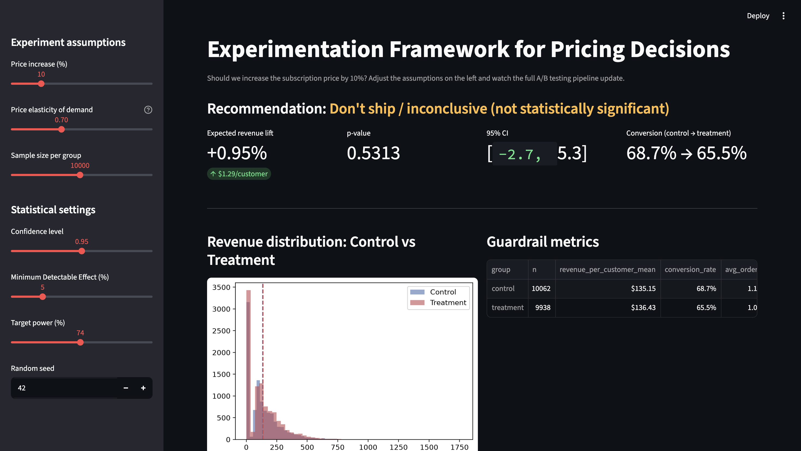

# Experimentation Framework for Pricing Decisions

### An end-to-end A/B testing simulator, built around one real business question:

> **Should we increase the subscription price by 10%?**

Pricing changes are among the highest-impact product decisions a company can make. Raising prices
can grow revenue — but it can also depress conversion and purchase frequency enough to wipe out the
gain, or worse. This project shows how to **design, run, and validate** an A/B test for a pricing
decision the way an experimentation scientist would: starting from the business question, through
power analysis, hypothesis testing, sensitivity analysis, and a Monte Carlo simulation of the whole
pipeline — plus an interactive dashboard a stakeholder can play with directly.

Every notebook is backed by tested, reusable code in `src/`, so the same functions power the
notebooks, the dashboard, and (with a swap of the data source) a real dataset.

---

## Business question → primary metric → guardrails

| | |
|---|---|
| **Business question** | Should we increase the subscription price by 10%? |
| **Primary metric** | Revenue per customer |
| **Guardrail metrics** | Conversion rate · Order count · Average order value |
| **H₀** | The price increase has no effect on revenue per customer |
| **H₁** | The price increase changes revenue per customer |

---

Dashboard

A stakeholder can move the sliders (price increase, elasticity, sample size, confidence level,
power, MDE) and watch the recommendation update live — no notebook required.

---

## Notebook walkthrough

### 01 — Business Understanding
Establishes the current state of the business from a synthetic (or your real) customer dataset:
customer count, total revenue, average order value, purchase frequency, a simple CLV estimate,
revenue distribution, and how concentrated revenue is among high-value customers. Also sets the
primary metric (revenue/customer) and guardrails (conversion, orders, order value) used everywhere
downstream.

### 02 — Experiment Design
States H₀/H₁, randomizes customers 50/50 into control/treatment, and defines the treatment: a price
increase paired with a **price elasticity of demand** model (e.g. a 10% price increase → 5% fewer
purchases, fully configurable). Includes an A/A balance check to confirm randomization worked.

### 03 — Power Analysis
The planning notebook. Given a business-defined Minimum Detectable Effect (MDE = 5% of current
revenue/customer), computes the required sample size for 80% power at alpha = 0.05, then visualizes
how that sample size moves with MDE, metric variance, power, and confidence level. On the synthetic
dataset used here, this comes out to **~7,000 customers per group** — a direct consequence of
revenue being a noisy, zero-inflated metric with a small standardized effect size relative to $6
(5% of $120).

### 04 — A/B Testing
Runs the experiment at the planned sample size and walks through the full analysis chain: control
mean → treatment mean → difference → variance → standard error → confidence interval → Welch's
t-test → p-value → a **Ship / Don't ship** recommendation, cross-checked against the guardrail
metrics.

### 05 — Sensitivity Analysis
Re-runs the entire pipeline across a range of elasticity assumptions (since the "true" elasticity is
never known in advance) and identifies the elasticity threshold at which the recommendation flips
from Ship to Don't ship — turning a single point estimate into a decision management can reason
about under uncertainty.

### 06 — Monte Carlo Simulation ⭐
The portfolio differentiator. Rather than trusting a single experiment's p-value, this notebook runs
**10,000 simulated experiments** under a known ground truth and empirically measures:
- **Power** — how often a true 5% lift is actually detected at the planned sample size
- **Type I error rate** — how often the test falsely rejects H₀ when there's truly no effect
- **Type II error rate** — how often it misses a real effect
- **Confidence interval coverage** — whether a "95% CI" really contains the truth ~95% of the time
- **False discovery rate** — an illustrative estimate of what fraction of "wins" would be false
  positives if only a fraction of tested pricing ideas are truly effective

This is what makes "statistical power" tangible rather than just a formula.

---

## Key findings (on the synthetic dataset used in this repo)

- Baseline revenue/customer ≈ **$133**, with a **5% MDE** (≈$6.65).
- That requires **~7,080 customers/group** (≈14,000 total) for 80% power at alpha = 0.05 — roughly
  **10 days** of runtime at 1,500 eligible customers/day.
- At the assumed elasticity (0.5 — a 10% price increase costs ~5% of purchases), the experiment
  shows a statistically significant **+6.2% revenue lift** (95% CI: [$4.13, $12.27], p < 0.001) →
  **recommendation: Ship.**
- Sensitivity analysis shows this recommendation holds up to roughly elasticity ≈ 0.8–1.0, beyond
  which the price increase stops paying for itself — a concrete number to monitor for post-launch.
- Monte Carlo simulation confirms the testing procedure is well-calibrated: **Type I error ≈ 5%**
  (matches alpha) and **95% CI coverage ≈ 94–95%**, with empirical power in the 70–80% range at the
  planned sample size — consistent with, though slightly below, the closed-form estimate, which is
  expected given revenue's real (skewed, zero-inflated) distribution versus the normal
  approximation the closed-form formulas rely on.

*(Re-running with a different random seed or on real data will naturally shift these exact numbers —
the framework and the decision process are the reusable part.)*

---

## Possible extensions

- **CUPED / covariate adjustment** to reduce variance and shrink the required sample size.
- **Stratified or sequential (always-valid) testing** to make decisions before the full sample
  accrues, when appropriate.
- **Multiple-metric correction** (e.g. Bonferroni or Benjamini-Hochberg) if testing several
  guardrails/segments simultaneously.
- **Heterogeneous treatment effects** — does the price increase help some segments (e.g. Premium
  tier) and hurt others (e.g. Basic tier)? Notebook 2's plan-tier breakdown is a natural starting
  point.
- Swap the synthetic generator in `src/data_processing.py` for a real billing/orders export by
  matching its output schema (`customer_id`, `orders`, `order_value`, `revenue`, `converted`, ...).
